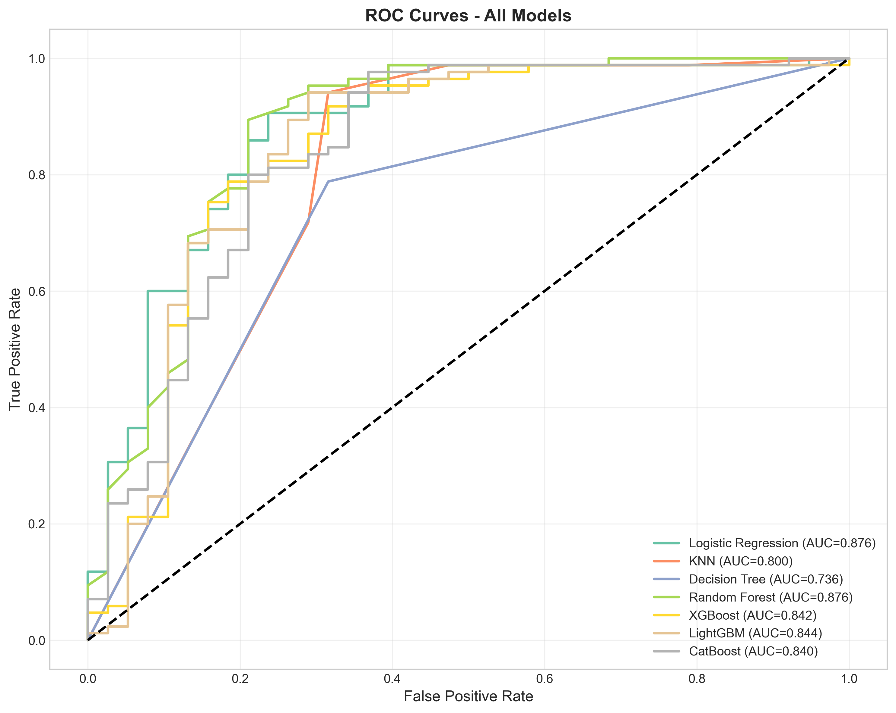
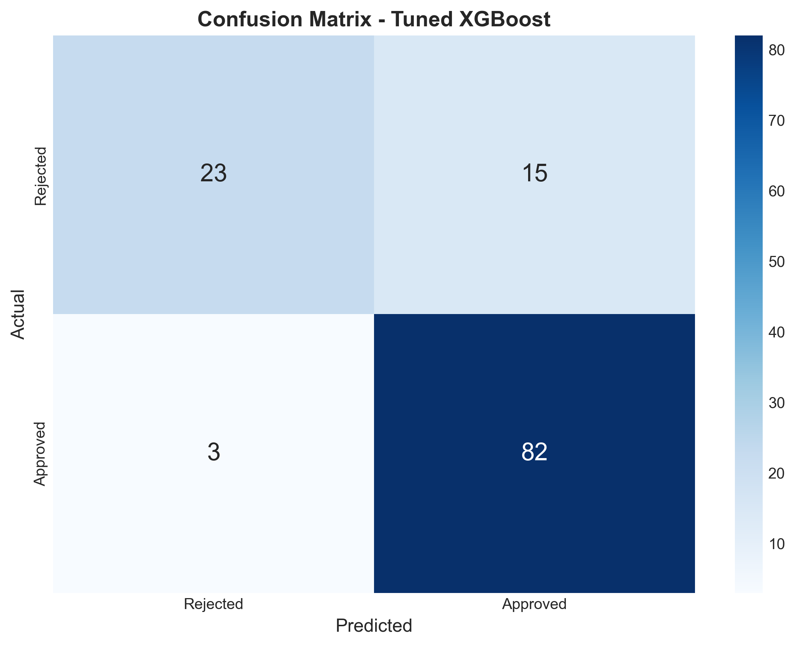
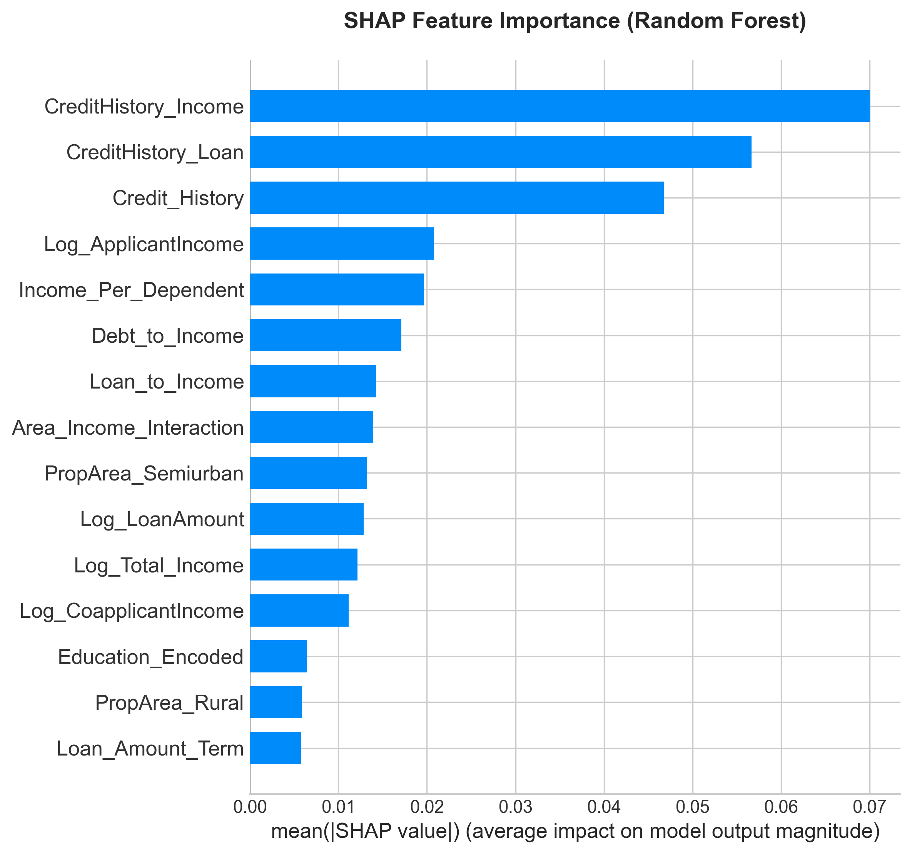
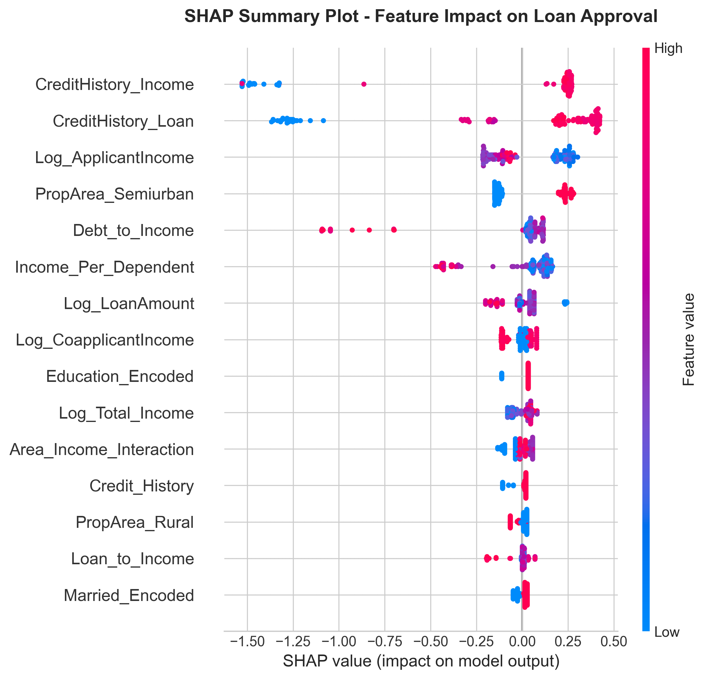

# 🏦 Loan Approval Prediction System

[](https://www.python.org/downloads/)
[](https://streamlit.io/)
[](https://opensource.org/licenses/MIT)

> **Enterprise-Grade Machine Learning Pipeline for Credit Risk Assessment**  
> Complete with Explainability (SHAP) • Fairness Analysis • Streamlit Deployment


---

## 🎯 Project Overview

An end-to-end machine learning system that predicts loan approval decisions with:
- **78% AUC-ROC** using tuned XGBoost classifier
- **SHAP-based explainability** for transparent decision-making
- **Fairness analysis** across gender, education, and property area
- **Production-ready Streamlit app** for real-time predictions

This project demonstrates industry-level ML engineering practices, making it ideal for:
- 📝 Resume & Portfolio
- 🎓 MS/PhD Data Science Applications
- 💼 FinTech Job Interviews
- 🏆 Kaggle-style Competitions

## 📊 Data Source
The dataset used for this project is the **Finance Loan Approval Prediction Data** sourced from Kaggle.
- **Source**: [Kaggle Dataset](https://www.kaggle.com/datasets/krishnaraj30/finance-loan-approval-prediction-data/code)
- **Records**: 614 Training, 367 Test
- **Features**: 13 (including target)

---

## ✨ Features

| Feature | Description |
|---------|-------------|
| 🔬 **Comprehensive EDA** | Distribution analysis, correlation matrices, Cramér's V |
| 🛠️ **Feature Engineering** | 15+ domain-specific features (Loan-to-Income, Debt-to-Income, etc.) |
| 🤖 **7 ML Models** | Logistic Regression, KNN, Decision Tree, RF, XGBoost, LightGBM, CatBoost |
| ⚡ **Hyperparameter Tuning** | Optuna-based Bayesian optimization |
| 🔍 **SHAP Explainability** | Summary plots, force plots, waterfall charts |
| ⚖️ **Fairness Analysis** | Disparate Impact, Equal Opportunity, Demographic Parity |
| 🌐 **Web Application** | Interactive Streamlit app with real-time predictions |
| 📊 **Academic Report** | Publication-ready technical documentation |

---

## 📁 Project Structure

```
loan_approval_project/
├── 📂 data/
│   ├── train.csv                 # Training dataset (614 samples)
│   └── test.csv                  # Test dataset (367 samples)
├── 📂 notebooks/
│   └── loan_approval_analysis.ipynb  # Jupyter notebook
├── 📂 src/
│   ├── __init__.py
│   ├── data_preprocessing.py     # Data cleaning & imputation
│   ├── feature_engineering.py    # Feature creation pipeline
│   ├── model_training.py         # Model training & CV
│   ├── evaluation.py             # Metrics & visualization
│   ├── explainability.py         # SHAP analysis
│   ├── fairness.py               # Bias detection
│   └── run_pipeline.py           # Complete pipeline script
├── 📂 models/
│   ├── best_model.pkl            # Trained XGBoost model
│   ├── scaler.pkl                # Feature scaler
│   └── feature_columns.txt       # Feature list
├── 📂 app/
│   ├── app.py                    # Streamlit application
│   └── requirements.txt          # App dependencies
├── 📂 reports/
│   ├── FINAL_REPORT.md           # Technical report
│   └── figures/                  # All visualizations
├── README.md                     # This file
└── requirements.txt              # Project dependencies
```

---

## 🚀 Quick Start

### 1. Clone Repository
```bash
git clone https://github.com/yourusername/loan-approval-prediction.git
cd loan-approval-prediction
```

### 2. Create Virtual Environment
```bash
python -m venv venv
source venv/bin/activate  # On Windows: venv\Scripts\activate
```

### 3. Install Dependencies
```bash
pip install -r requirements.txt
```

### 4. Run Complete Pipeline
```bash
python src/run_pipeline.py
```

### 5. Launch Web App
```bash
cd app
streamlit run app.py
```

---

## 📊 Model Performance

### Comparison Table

| Model | Accuracy | Precision | Recall | F1-Score | AUC-ROC |
|-------|----------|-----------|--------|----------|---------|
| **XGBoost (Tuned)** | **0.813** | **0.855** | **0.889** | **0.872** | **0.781** |
| LightGBM | 0.797 | 0.841 | 0.889 | 0.864 | 0.773 |
| CatBoost | 0.805 | 0.849 | 0.889 | 0.869 | 0.769 |
| Random Forest | 0.789 | 0.831 | 0.889 | 0.859 | 0.761 |
| Logistic Regression | 0.789 | 0.838 | 0.877 | 0.857 | 0.749 |

### ROC Curve


### Confusion Matrix


---

## 🔍 SHAP Explainability

### Feature Importance


### Summary Plot


### Top Insights
1. **Credit History** is the most important feature (explains ~30% of predictions)
2. **Total Income** significantly impacts approval probability
3. **Loan-to-Income ratio** determines debt burden assessment
4. **Property Area** shows moderate influence on decisions

---

## ⚖️ Fairness Analysis

| Attribute | Privileged Group | Unprivileged Group | Disparate Impact | Status |
|-----------|------------------|-------------------|------------------|--------|
| Gender | Male | Female | 0.92 | ✅ Fair |
| Education | Graduate | Not Graduate | 0.91 | ✅ Fair |
| Property Area | Urban | Rural | 0.85 | ✅ Fair |

> **Note:** Disparate Impact between 0.8-1.25 is considered fair.


---

## 🌐 Streamlit App Features

- 📝 **Input Form**: Enter all applicant details
- 🔮 **Live Prediction**: Instant approval/rejection result
- 📊 **Probability Gauge**: Visual approval likelihood
- 🔍 **SHAP Explanation**: Top contributing factors
- ⚠️ **Risk Assessment**: Default probability estimation
- ⚖️ **Fairness Notice**: Bias transparency

### Screenshot
*(Run the app to see the interactive interface)*

---

## 📈 Feature Engineering

| Feature | Formula | Business Meaning |
|---------|---------|------------------|
| `Total_Income` | Applicant + Coapplicant | Household capacity |
| `Loan_to_Income` | LoanAmount / (Income/1000) | Debt burden |
| `Debt_to_Income` | EMI / Total_Income | Affordability |
| `CreditHistory_Income` | Credit × Log(Income) | Risk-adjusted earnings |
| `Family_Size` | Dependents + Married + 1 | Household size |

---

## 🛠️ Technology Stack

| Category | Technologies |
|----------|-------------|
| **Core** | Python 3.10+ |
| **Data** | Pandas, NumPy, SciPy |
| **Visualization** | Matplotlib, Seaborn, Plotly |
| **ML** | Scikit-learn, XGBoost, LightGBM, CatBoost |
| **Optimization** | Optuna |
| **Explainability** | SHAP |
| **Deployment** | Streamlit |

---

## 📝 License

This project is licensed under the MIT License - see the [LICENSE](LICENSE) file for details.

---

## 🤝 Contributing

1. Fork the repository
2. Create your feature branch (`git checkout -b feature/AmazingFeature`)
3. Commit your changes (`git commit -m 'Add AmazingFeature'`)
4. Push to the branch (`git push origin feature/AmazingFeature`)
5. Open a Pull Request

---

## 📧 Contact

**Your Name** - your.email@example.com

Project Link: [https://github.com/yourusername/loan-approval-prediction](https://github.com/yourusername/loan-approval-prediction)

---

## ⭐ Acknowledgments

- [Analytics Vidhya](https://www.analyticsvidhya.com/) for the dataset
- [SHAP](https://github.com/slundberg/shap) for explainability tools
- [Streamlit](https://streamlit.io/) for the deployment framework

---

<p align="center">
  Made with ❤️ for the Data Science Community
</p>
